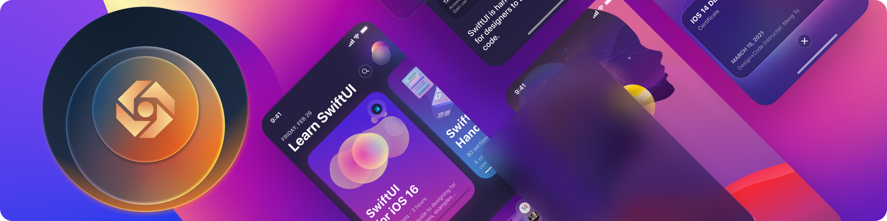

### Welcome! 👋

I'm João Carlos Magalhães, a 16-year-old student based in Brazil. Nice to meet you 🥳🥳!

I have always been passionate and excited about everything that involves technology 🖥, design 🖌 and innovation ⭐️. I'm studying Computer Science at Federal Institute of Rio Grande do Norte and I'm currently learning mobile (mainly iOS) and web development, and it's been an amazing experience!

If you want to talk, feel free to reach me on my social links or send me an e-mail 📪.

 
   
  
   
  
   

